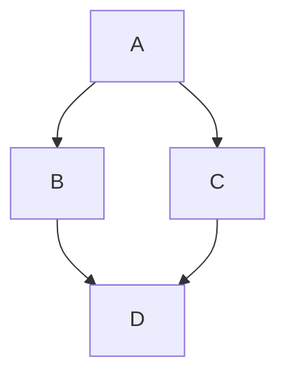

# 🚀 Feature Request - Cylinder Detection & Goal Pose Generation Service

 

## 📌 Summary

Summary about the feature

 

## 🎯 Problem Statement

Problem statement

 

### ❗ Impact

Mention the impact

 

## 💡 Proposed Solution

Give a brief about the solution

 

## 🔄 System Flow Diagram

 

## 🧠 Approach / Methodology

### 1. Step 1

* Points

### 2. Step 2

* Points

 

## 📥 Inputs

* `radius` (float)

 

## 📤 Outputs

* `geometry_msgs/PoseStamped`
* Valid goal pose for navigation

 

## ✅ Expected Behavior

* Point 1
* Point 2

 

## 🚧 Challenges / Considerations

* Point 1
* Point 2

 

## 📋 Acceptance Criteria

* [ ] ROS2 service is implemented
* [ ] Accurate center estimation
* [ ] Valid goal pose generation
* [ ] Proper documentation added

---

